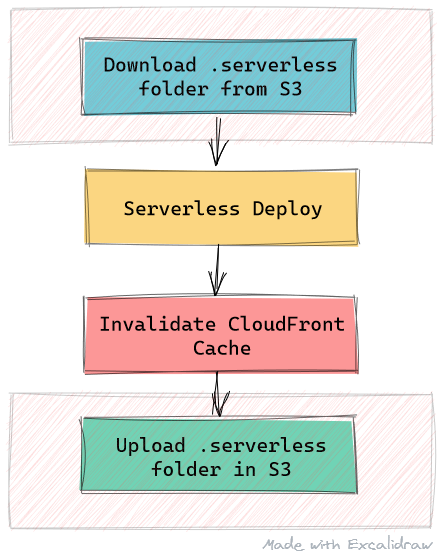

## Intro

We wanted to switch to [NextJS](https://nextjs.org/) for an application, and for that, we felt the need to easily deploy it in AWS. After doing some research, I came across with [Serverless NextJS Component](https://serverless.com/blog/serverless-nextjs/) by [Daniel Conde](https://twitter.com/dcondemarin). As the name says, components are a new way to build Serverless applications. Basically it's the same concept as a React component, building and sharing usable parts of serverless (like S3, APIGateways, etc).

At the beginning, I was **TOTALLY** impressed. This is how our `serverless.yml` looked like:

```yml
# serverless.yml

myApp:

 component: serverless-next.js
```

WOW. Just. WOW. That's ultra simple, and we love simple stuff. If we run `serverless`, it'll deploy everything we need to AWS, including:

- S3 Bucket: for assets and application build.
- Lambdas: for doing our server side rendering job.
- CloudFront: for using our previously lambda and giving us an url to access the site.

However, we realized there was an issue with this. Every time we run `serverless`, it'd end up creating new resources on AWS. How could we resolve this? 

Very simple, indeed. Let's name our resources, using the `inputs` parameter in our `component`.

```yml
# serverless.yml

nextApp:
  component: serverless-next.js
  inputs:
    bucketName: my-name-of-choice-deployment-bucket
    name: my-name-of-choice-default-lambda
```

Okay, what have we done? So far, we've named our deployment bucket, our lambdas and... Wait, where is our CloudFront Distribution? 

Sadly, right now there is no way to reutilize the previously created CloudFront Distribution. This is **not** a NextJS Serverless Component issue; it's a Cloudfront Component issue, and it's stated on the [NextJS Component repo](https://github.com/danielcondemarin/serverless-next.js/tree/master/packages/serverless-nextjs-component#cicd-a-new-cloudfront-distribution-is-created-on-every-ci-build-i-wasnt-expecting-that):

    [CI/CD] A new CloudFront distribution is created 
    on every CI build. I wasn't expecting that:
   
    You need to commit your application state in source control. 
    That is the files under the .serverless directory. 
    The serverless team is currently working on remote state 
    storage so this won't be necessary in the future.

We can't just commit our application state in source control. At least, that wasn't an option for us. So, how could we resolve this?

## Workaround

Since we've setup Github Actions for deploying our app, we've realized we could upload the `.serverless` folder on the deployment bucket in S3. Our _new_ pipeline would look something like this:



We'll go into detail for each step, and even though perhaps you are not using Github Actions, you should be able to do the same for the pipeline you are using.

NOTA: You'll need to install AWS CLI. If you are using Github Actions like us, you can use [aws-actions](https://github.com/aws-actions/configure-aws-credentials).

### Downloading .serverless folder from S3

Our `.serverless` folder contains a json file named `Template.nextApp.CloudFront`. Over there, we'll have our CloudFront Distribution information. Here's the script bash we'll use for downloading the file. 

```bash
CLOUDFRONT_FILE=.serverless/Template.nextApp.CloudFront.json

aws s3 ls s3://${{ secrets.S3_DEPLOYMENT_BUCKET }}/$CLOUDFRONT_FILE
if [[ $? -ne 0 ]]; 
then
  echo 'Serverless folder does not exist in S3. This is the first deploy in this environment.'
else
  aws s3 sync s3://${{ secrets.S3_DEPLOYMENT_BUCKET }}/.serverless ./.serverless
  echo 'Finshed download Serverless folder from S3'
fi
```

The script is almost self-explanatory. We'll list our S3 Deployment Bucket items. If we don't have our `.serverless/Template.nextApp.CloudFront.json` file, it means that it's our first deploy. If that's our case, we'll ignore this step.

If the file does exist, we'll download it so our `serverless` deploy can use it.

### Invalidating CloudFront Distribution Cache

After running our deploy step (should just be running `serverless`), we'll proceed to invalidate our CloudFront Distribution Cache.

```bash
CLOUDFRONT_FILE=.serverless/Template.nextApp.CloudFront.json

# read "id" attribute from Template.nextApp.CloudFront.json
CLOUDFRONT_DISTRIBUTION_ID="$(grep -Po '"id": *\K"[^"]*"' $CLOUDFRONT_FILE | sed "s/\"//g")" 

echo "Creating invalidation for CloudFront for distribution: $CLOUDFRONT_DISTRIBUTION_ID"
aws cloudfront create-invalidation --distribution-id $CLOUDFRONT_DISTRIBUTION_ID --paths '/*';
echo 'Finished invalidation for CloudFront'
```

We'll grep our CloudFront file looking for its id, and create an invalidation for it.

### Syncing Serverless folder with S3

Lastly, we'll sync our `.serverless` folder in S3. We'll check if the file exists on S3. If it does, we'll do nothing. Otherwise, we'll upload our `.serverless` folder to S3.

```bash
echo 'Checking if Serverless folder is missing in S3'

aws s3 ls s3://${{ secrets.S3_DEPLOYMENT_BUCKET }}/$CLOUDFRONT_FILE
if [[ $? -ne 0 ]]; 
then
  echo 'Syncing Serverless folder with S3'
  aws s3 sync ./.serverless s3://${{ secrets.S3_DEPLOYMENT_BUCKET }}/.serverless
else
  echo 'Serverless folder already exists on S3'
fi
```

## Conclusion

Although this is not the ideal solution, we believe it is the best way to workaround this situation at the moment. The NextJS Component already supports reusing a CloudFront Distribution Id, but it's the [AWS CloudFront Component that doesn't support using an existing id](https://github.com/serverless-components/aws-cloudfront/issues/11), and it seems we won't get it soon.

Anyways, I love the idea of Serverless Components and how *EASY* applications deployment and configuration are. I strongly believe it's game changing for sure. It's sad that they don't receive the attention they deserve.

I hope you've liked the article and found it helpful. Please feel free to reach me out on Twitter for any further concerns!